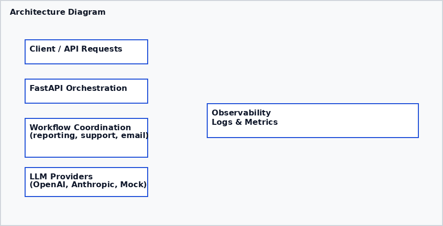
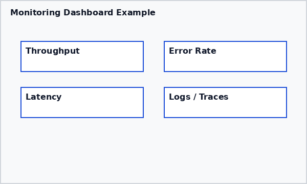
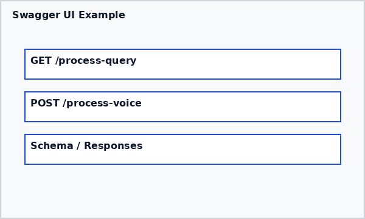
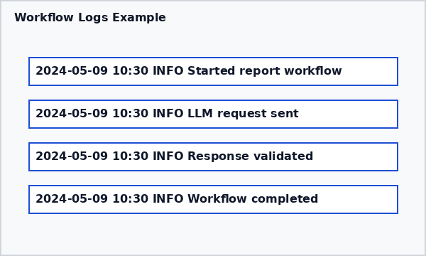

# Modular AI Workflow Automation Platform

> Demonstrates a modular workflow automation platform for API-driven orchestration, monitoring, and extensible automation pipelines.

**Live Demo**: [Google Colab](https://colab.research.google.com/github/Vaishnavidorlikar/ai-automation-workflows-llm/blob/main/notebooks/AI_Automation_Demo.ipynb) | **GitHub**: [View Source](https://github.com/Vaishnavidorlikar/ai-automation-workflows-llm)

## Why This Project

This repository demonstrates how AI workflow orchestration, API integration, monitoring, and automation pipelines can be combined into a scalable data-driven platform architecture. It implements prototype architecture for modular AI systems with a focus on maintainable backend workflows and observability.

> Note: Some integrations and workflows are demonstration modules intended to showcase orchestration architecture and extensible workflow design.

## Architecture Overview

```
API / Client Requests
    ↓
FastAPI Orchestration Layer
    ↓
Workflow Coordination (reporting, email, support)
    ↓
LLM Providers (OpenAI, Anthropic, Mock)
    ↓
Logs, metrics, evaluation outputs
```



## Components

### AI Orchestration
- Modular workflow coordination
- Configuration-driven orchestration
- Event-driven processing architecture
- Pluggable component system

### Voice Processing
- Voice assistant integration demo using speech-to-text APIs
- Prototype audio input handling
- Demo voice workflow support

### Gesture Recognition
- Gesture recognition prototype (MediaPipe demo)
- Experimental multi-modal input processing
- Prototype event signal handling

### Monitoring & Evaluation
- Example response quality assessment
- Sample performance logging and observability
- Demonstration regression validation support
- Structured logging for traceability

### API Layer
- RESTful endpoints with FastAPI
- Asynchronous request handling
- Error handling and validation
- API documentation with OpenAPI

### Workflow Automation
- Customer support flow automation
- Reporting workflow orchestration
- Email processing pipelines
- Document analysis automation

## Engineering Challenges Solved

* Managing multi-modal input pipelines with different data formats
* Handling asynchronous API orchestration across multiple LLM providers
* Monitoring response consistency and example observability outputs
* Structuring modular workflow execution for maintainability
* Reducing workflow failures through comprehensive error handling
* Implementing configuration-driven architecture for different environments
* Building extensible provider integrations for future LLM services

## Engineering Focus

- Workflow orchestration
- API integration
- Backend automation
- Observability and monitoring
- Modular system design
- Event-driven processing
- AI workflow experimentation

## Sample API Usage

### Process Query Endpoint

**Request:**
```bash
POST /process-query
Content-Type: application/json

{
  "input_type": "text",
  "query": "Generate monthly sales report",
  "workflow_type": "reporting"
}
```

**Response:**
```json
{
  "status": "success",
  "response": "Monthly sales report generated successfully. Key metrics: Total revenue $125,430, Growth rate 12.5%, Top product: Widget A",
  "processing_time_ms": 420,
  "confidence_score": 0.92,
  "workflow_id": "wf_12345"
}
```

### Voice Processing Endpoint

**Request:**
```bash
POST /process-voice
Content-Type: application/json

{
  "audio_data": "base64_encoded_audio",
  "input_type": "voice",
  "query_type": "summarization"
}
```

**Response:**
```json
{
  "status": "success",
  "transcription": "Please summarize the quarterly financial report",
  "response": "Q3 financial summary: Revenue up 15%, expenses down 8%, net profit margin 22%",
  "processing_time_ms": 680,
  "audio_duration": 3.2
}
```

## Scalability Considerations

* **Stateless API Architecture**: Horizontal scaling through load balancers
* **Modular Workflow Execution**: Independent components for parallel processing
* **Config-Driven Orchestration**: Environment-specific configurations without code changes
* **Extensible Provider Integrations**: Easy addition of new LLM or service providers
* **Observability Architecture**: Isolated observability systems for operational insight
* **Asynchronous Processing**: Non-blocking operations for high-throughput scenarios
* **Resource Pooling**: Connection reuse for external API calls

## Monitoring & Evaluation Examples

### Example Monitoring Output
```
Workflow: customer_support_flow
├── Sample accuracy score: 0.94
├── Sample response time: 320ms
├── Example consistency indicator: low
└── Sample trace event: workflow completed
```

### Workflow Execution Logs
```
2024-01-15 10:30:15 INFO  Starting workflow: report_generation
2024-01-15 10:30:16 INFO  LLM Provider: OpenAI GPT-4
2024-01-15 10:30:18 INFO  Data analysis completed: 3 datasets processed
2024-01-15 10:30:20 INFO  Report generated: 1250 words, confidence 0.91
2024-01-15 10:30:21 INFO  Workflow completed successfully
```

### Performance Dashboard Screenshot


### API Swagger UI Example


### Workflow Logs Example


## Project Structure

```
ai-automation-workflows-llm/
├── .github/                    # CI/CD workflows
├── api/
│   └── app.py                  # REST API endpoints
├── assets/                    # Architecture and screenshot visuals
├── src/
│   ├── agents/
│   │   ├── email_agent.py      # Email processing agent
│   │   ├── report_agent.py     # Report generation agent
│   │   └── summarizer.py       # Text summarization agent
│   ├── aiml/
│   │   └── aiml_processor.py   # AI/ML processing utilities
│   ├── data_analysis/
│   │   └── data_analyzer.py    # Data analysis tools
│   ├── deep_learning/
│   │   └── model_manager.py    # Deep learning model management
│   ├── gesture_recognition/
│   │   └── gesture_detector.py  # Gesture recognition (demo)
│   ├── integration/
│   │   ├── __init__.py
│   │   └── ai_orchestrator.py   # Main orchestration logic
│   ├── jarvis/
│   │   └── jarvis_assistant.py  # Voice assistant (demo)
│   ├── ml_models/
│   │   └── sklearn_manager.py   # ML model utilities
│   ├── utils/
│   │   ├── llm_client.py       # LLM API client
│   │   └── prompt_templates.py  # Prompt management
│   └── workflows/
│       ├── automate_reporting.py # Reporting workflows
│       └── customer_support_flow.py # Support automation
├── config/
│   └── config.yaml             # Configuration files
├── notebooks/
│   ├── ai_automation_dashboard.ipynb
│   ├── AI_Automation_Demo.ipynb
│   └── experimentation.ipynb   # Experimental notebooks
├── tests/
│   └── test_agents.py          # Unit tests
├── main.py                     # Core application entry point
├── requirements.txt            # Python dependencies
├── requirements-dev.txt        # Development dependencies
├── requirements-optional.txt   # Optional demo and extended features
├── Dockerfile                  # Container definition
├── docker-compose.yml          # Multi-container setup
├── .gitignore                  # Repository exclusions
├── .env.example                # Environment template
└── README.md
```

## Quick Start

### Prerequisites
- Python 3.8+
- API keys for OpenAI and/or Anthropic

### Installation
```bash
# Clone the repository
git clone https://github.com/Vaishnavidorlikar/ai-automation-workflows-llm.git
cd ai-automation-workflows-llm

# Install dependencies
pip install -r requirements.txt
```

### Environment Setup
Create a `.env` file in the root directory:

```env
OPENAI_API_KEY=your_openai_api_key_here
ANTHROPIC_API_KEY=your_anthropic_api_key_here
LOG_LEVEL=INFO
```

### Running the Application
```bash
# Start the API server
uvicorn api.app:app --reload

# For production deployment
uvicorn api.app:app --host 0.0.0.0 --port 8000
```

### Docker Deployment
```bash
# Build and run with Docker Compose
docker-compose up --build

# Or build and run manually
docker build -t ai-workflow-platform .
docker run -p 8000:8000 --env-file .env ai-workflow-platform
```

### Run Demo
```bash
# Run the core application
python main.py --demo all
```

### Optional Dashboard Notebooks
```bash
jupyter notebook notebooks/AI_Automation_Demo.ipynb
```

### Live Demo in Colab
**[Run in Google Colab](https://colab.research.google.com/github/Vaishnavidorlikar/ai-automation-workflows-llm/blob/main/notebooks/AI_Automation_Demo.ipynb)**

## Project Setup

### Core dependencies
```bash
pip install -r requirements.txt
```

### Development dependencies
```bash
pip install -r requirements-dev.txt
```

### Optional demo and extended features
```bash
pip install -r requirements-optional.txt
```

## Tech Stack

* **Python** - Core programming language
* **FastAPI** - REST API framework
* **Docker** - Containerization
* **REST APIs** - Service integration
* **Async processing** - Non-blocking orchestration
* **YAML configuration** - Environment-driven setup
* **OpenAI / Anthropic APIs** - External AI providers
* **TensorFlow / Scikit-learn** - Model and analytics utilities
* **MediaPipe** - Gesture recognition prototype
* **NumPy / Pandas** - Data processing
* **Matplotlib** - Reporting and visualization
* **pytest** - Testing framework

## Monitoring & Evaluation

This project includes example monitoring and evaluation outputs to illustrate observability and workflow validation concepts:

- **Prompt evaluation examples**: Demonstrates prompt and response quality checks
- **Regression validation**: Example workflow consistency checks
- **Response monitoring**: Sample tracking of API response performance
- **Observability data**: Logging and metric examples for tracing
- **Monitoring architecture**: Prototype dashboard and logs for operational insight

## Potential Cloud Extensions

- Deploy FastAPI on Cloud Run for containerized API hosting
- Use Cloud Composer / Apache Airflow for workflow scheduling
- Route events through Pub/Sub for event-driven orchestration
- Capture logs and metrics with Cloud Logging and Cloud Monitoring
- Store artifacts in Artifact Registry and integrate with Cloud Build
- Use IAM and service accounts for secure API / workflow access

## Use Cases

### Automated Support Workflows
- Intelligent customer ticket routing and response generation
- Automated FAQ processing and knowledge base queries
- Support workflow orchestration with escalation logic

### AI-Assisted Operations
- Document processing and summarization pipelines
- Email automation and prioritization
- Report generation from structured data

### API Orchestration
- Multi-service API integration and data aggregation
- Workflow automation across different systems
- Event-driven processing and notifications

### Data-Driven Automation
- Automated data analysis and insight generation
- Real-time dashboard updates and alerting
- Business intelligence workflow automation

## Future Improvements

* Streaming event integration for real-time processing
* Message queue integration (Kafka/PubSub) for workflow decoupling
* Orchestration optimization with workflow caching
* Advanced workflow scheduling and cron job support
* Cloud deployment configurations (AWS/GCP/Azure)
* Enhanced containerization with Kubernetes manifests
* API rate limiting and request throttling
* Advanced monitoring with Prometheus/Grafana integration

## ATS-Friendly Resume Points

* Developed modular AI workflow orchestration platform integrating LLM APIs, observability outputs, and automation workflows using Python and FastAPI.
* Implemented evaluation and response monitoring examples to improve reliability and reduce workflow regressions.
* Built API-driven automation framework supporting multi-modal interaction workflows with structured logging and error handling.
* Designed event-driven processing architecture for scalable backend operations and real-time data processing.
* Containerized application with Docker for consistent deployment across environments.
* Established CI/CD pipeline with automated testing and linting for code quality assurance.

## Contact

- **Email**: dorlikarvaishnavi1@gmail.com
- **LinkedIn**: [linkedin.com/in/vaishnavidorlikar](https://linkedin.com/in/vaishnavidorlikar)
- **GitHub**: [github.com/Vaishnavidorlikar](https://github.com/Vaishnavidorlikar)
- **Portfolio**: [vaishnavidorlikar.com](https://vaishnavidorlikar.com)

---

**Built by Vaishnavi Dorlikar | Data Engineer & AI Enthusiast**

**Demonstrating workflow orchestration and AI integration using Python, FastAPI, and LLM technologies**
